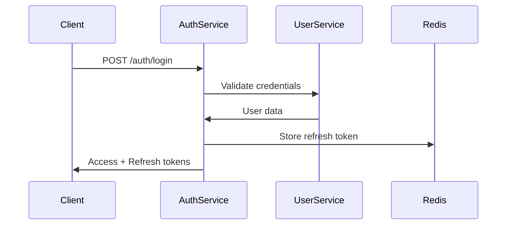
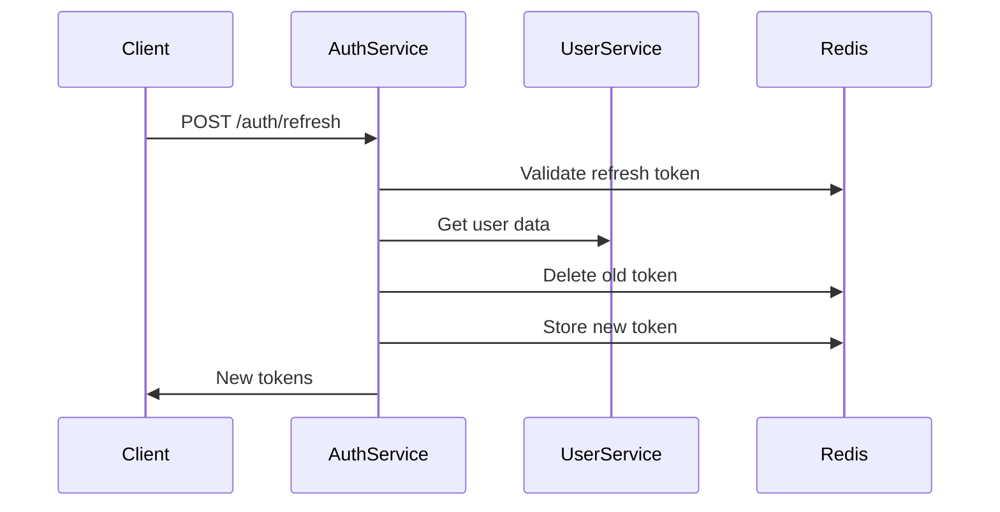
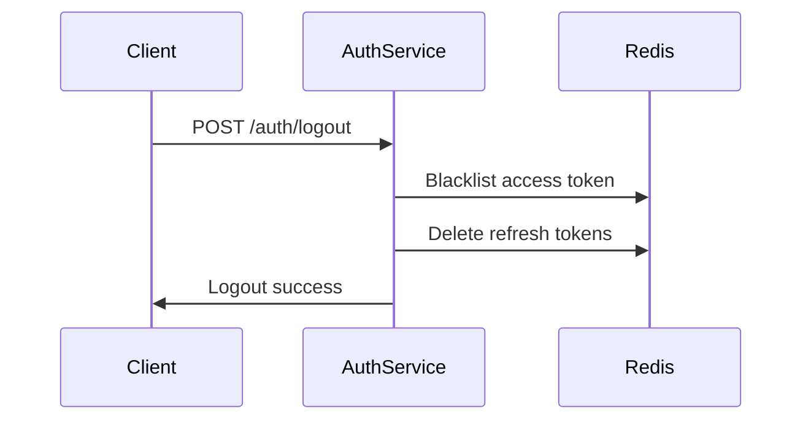

# 🔐 Auth Service Documentation

## **Overview**

The **Auth Service** is a dedicated microservice responsible for authentication and authorization in our microservices architecture. It implements **JWT-based authentication** with **refresh token rotation**, **token blacklisting**, and **secure inter-service communication**.

## **🎯 Key Features**

### **Authentication & Authorization**
- ✅ **JWT Access Tokens** (15 minutes expiry)
- ✅ **Refresh Token Rotation** (7 days expiry) 
- ✅ **Token Blacklisting** (logout/security)
- ✅ **Role-based Access Control** (RBAC)
- ✅ **Multi-device Login Support**
- ✅ **Session Management**

### **Security Features**
- ✅ **BCrypt Password Hashing** (12 rounds)
- ✅ **JWT with HS256 Algorithm**
- ✅ **Token Expiry Management**
- ✅ **IP Address Tracking**
- ✅ **User Agent Logging**
- ✅ **CORS Configuration**

### **Storage & Performance**
- ✅ **Redis for Token Storage** (TTL-based)
- ✅ **PostgreSQL for Metadata** (migrations)
- ✅ **Async Operations** (token cleanup)
- ✅ **Connection Pooling** (HikariCP)

### **Monitoring & Logging**
- ✅ **Structured Logging** (JSON + Logback)
- ✅ **AOP-based Audit Logging**
- ✅ **Performance Monitoring**
- ✅ **Security Event Logging**
- ✅ **Health Checks** (Actuator)

---

## **🏗️ Architecture**

### **Service Dependencies**
```
Auth Service
├── user-service (credential validation)
├── Redis (token storage)
├── PostgreSQL (metadata)
└── API Gateway (future)
```

### **Database Design**

#### **Redis Entities**
- **`RefreshToken`** - JWT refresh tokens with TTL
- **`TokenBlacklist`** - Invalidated tokens with reasons

#### **PostgreSQL Tables**
- **Token metadata** (audit trail)
- **Blacklist history** (compliance)

---

## **🔗 API Endpoints**

### **Public Endpoints**

#### **POST** `/auth/login`
**User Authentication**
```json
{
  "email": "user@example.com",
  "password": "password123",
  "rememberMe": false
}
```

**Response:**
```json
{
  "success": true,
  "message": "Login successful",
  "data": {
    "accessToken": "eyJhbGciOiJIUzI1NiJ9...",
    "refreshToken": "eyJhbGciOiJIUzI1NiJ9...",
    "tokenType": "Bearer",
    "expiresIn": 900000,
    "userId": 1,
    "email": "user@example.com",
    "fullName": "John Doe",
    "roles": ["USER"],
    "loginAt": "2024-01-15T10:30:00"
  }
}
```

#### **POST** `/auth/refresh`
**Token Refresh**
```json
{
  "refreshToken": "eyJhbGciOiJIUzI1NiJ9..."
}
```

#### **POST** `/auth/validate-token`
**Token Validation** (for frontend)
```
?token=eyJhbGciOiJIUzI1NiJ9...
```

### **Protected Endpoints**

#### **POST** `/auth/logout`
**User Logout**
```http
Authorization: Bearer <access_token>
```

#### **POST** `/auth/logout-all`
**Logout from All Devices**

#### **GET** `/auth/profile`
**Get Current User Profile**

#### **GET** `/auth/tokens/count`
**Get Active Token Count**

### **Admin Endpoints**

#### **DELETE** `/auth/admin/users/{userId}/tokens`
**Revoke All User Tokens** (Admin only)

### **Internal API**

#### **POST** `/internal/validate-token`
**Token Validation** (for other services)
```http
X-Service-Name: post-service
X-Service-Secret: <internal_secret>
```

#### **GET** `/internal/users/{userId}/tokens/count`
**Get User Token Count**

#### **DELETE** `/internal/users/{userId}/tokens`
**Revoke User Tokens** (security operation)

#### **POST** `/internal/blacklist-token`
**Blacklist Specific Token**

---

## **🔧 Configuration**

### **Environment Variables**
```bash
# Database
DB_URL=jdbc:postgresql://localhost:5432/auth_service
DB_USERNAME=auth_user
DB_PASSWORD=auth_password

# Redis
REDIS_HOST=localhost
REDIS_PORT=6379

# JWT
JWT_SECRET=your-super-secret-jwt-key-here
JWT_EXPIRATION_MS=900000
JWT_REFRESH_EXPIRATION_MS=604800000

# Internal Security
INTERNAL_SECRET=your-internal-service-secret
```

### **Application Properties**
```yaml
server:
  port: 8084

app:
  jwt:
    secret: ${JWT_SECRET}
    access-token-expiration: ${JWT_EXPIRATION_MS:900000}
    refresh-token-expiration: ${JWT_REFRESH_EXPIRATION_MS:604800000}
  
  security:
    max-refresh-tokens-per-user: 5
    internal-secret: ${INTERNAL_SECRET}
  
  cors:
    allowed-origins:
      - http://localhost:3000
      - http://localhost:8080
    allowed-methods:
      - GET
      - POST
      - PUT
      - DELETE
      - OPTIONS
    allowed-headers: "*"
    allow-credentials: true
    max-age: 3600
```

---

## **🚀 Deployment**

### **Docker Setup**
```yaml
version: '3.8'
services:
  auth-service:
    build: ./auth-service
    ports:
      - "8084:8084"
    environment:
      - SPRING_PROFILES_ACTIVE=prod
      - DB_URL=jdbc:postgresql://postgres:5432/auth_service
      - REDIS_HOST=redis
    depends_on:
      - postgres
      - redis

  postgres:
    image: postgres:15
    environment:
      - POSTGRES_DB=auth_service
      - POSTGRES_USER=auth_user
      - POSTGRES_PASSWORD=auth_password

  redis:
    image: redis:7-alpine
    command: redis-server --appendonly yes
```

### **Startup Command**
```bash
mvn spring-boot:run -Dspring-boot.run.arguments="--spring.profiles.active=dev"
```

---

## **🔒 Security Considerations**

### **Token Management**
- **Access tokens**: Short-lived (15 minutes)
- **Refresh tokens**: Longer-lived (7 days) with rotation
- **Token blacklisting**: Immediate invalidation on logout/security events
- **Device limits**: Maximum 5 active sessions per user

### **Password Security**
- **BCrypt hashing** with 12 rounds
- **Password complexity** enforced via validation
- **No password storage** in auth service

### **Communication Security**
- **Internal API**: Protected with service secrets
- **HTTPS**: Required in production
- **CORS**: Configured for specific origins
- **Rate limiting**: Planned via API Gateway

---

## **📊 Monitoring & Observability**

### **Health Checks**
- **`/actuator/health`** - Service health status
- **`/actuator/metrics`** - Prometheus metrics
- **`/actuator/info`** - Service information

### **Logging Categories**
- **AUDIT**: User authentication events
- **SECURITY**: Security-related events
- **PERFORMANCE**: Service performance metrics
- **ERROR**: Error events and stack traces

### **Key Metrics**
- Login success/failure rates
- Token refresh frequency
- Active session counts
- Security events frequency

---

## **🔄 Token Flow**

### **Login Flow**


### **Refresh Flow**


### **Logout Flow**


---

## **🛠️ Development**

### **Prerequisites**
- Java 17+
- Maven 3.8+
- PostgreSQL 15+
- Redis 7+
- Docker (optional)

### **Setup Steps**
```bash
# 1. Clone repository
git clone <repo-url>
cd auth-service

# 2. Setup environment
cp dev.env.example dev.env
# Edit dev.env with your configuration

# 3. Start dependencies
docker-compose up postgres redis

# 4. Run migrations
mvn liquibase:update

# 5. Start service
mvn spring-boot:run -Dspring-boot.run.arguments="--spring.profiles.active=dev"
```

### **Testing**
```bash
# Unit tests
mvn test

# Integration tests
mvn verify -P integration-tests

# API tests
./test-api.sh
```

---

## **🔮 Future Enhancements**

### **Planned Features**
- [ ] **OAuth2 Integration** (Google, GitHub)
- [ ] **Multi-factor Authentication** (TOTP)
- [ ] **Device Management** (trusted devices)
- [ ] **Advanced Rate Limiting**
- [ ] **Audit Trail Dashboard**

### **Performance Optimizations**
- [ ] **Redis Clustering** for high availability
- [ ] **JWT Token Compression**
- [ ] **Connection Pool Tuning**
- [ ] **Caching Layers**

### **Security Enhancements**
- [ ] **Token Encryption** (JWE)
- [ ] **Anomaly Detection**
- [ ] **Geo-location Validation**
- [ ] **Advanced Threat Protection**

---

## **📞 Support & Contacts**

- **Service Owner**: Microservices Team
- **Documentation**: `/swagger-ui.html`
- **Health Check**: `/actuator/health`
- **Logs Location**: `./logs/auth-service-*.log`

---

**✅ Auth Service Ready for Production! 🚀**


