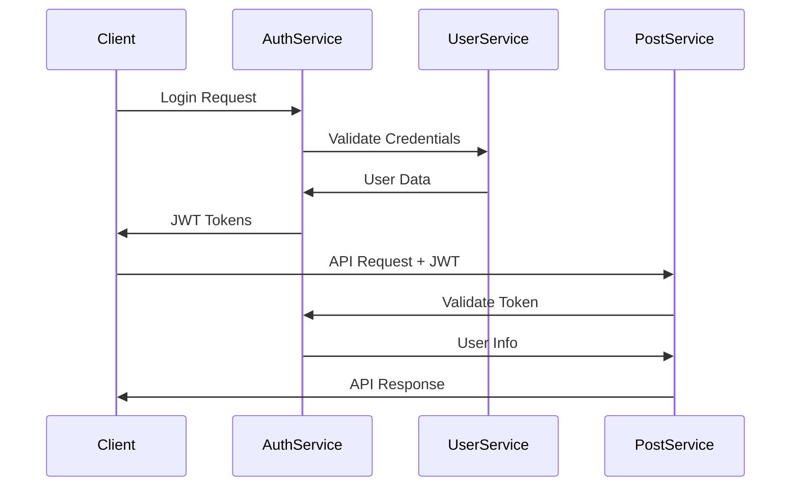

# 🏗️ Microservices Architecture Overview

## **🎯 System Architecture**

Our microservices ecosystem consists of **independent, production-ready services** with **unified structure** and **Spring Boot best practices**.

```
┌─────────────────┐    ┌─────────────────┐    ┌─────────────────┐
│   Frontend      │    │  API Gateway    │    │  Load Balancer  │
│   (React/Vue)   │◄──►│   (Future)      │◄──►│   (Nginx)       │
└─────────────────┘    └─────────────────┘    └─────────────────┘
                                │
                ┌───────────────┼───────────────┐
                │               │               │
        ┌───────▼──────┐ ┌──────▼──────┐ ┌─────▼──────┐
        │ Auth Service │ │ User Service│ │Post Service│
        │   :8084      │ │   :8081     │ │   :8082    │
        └──────────────┘ └─────────────┘ └────────────┘
                │               │               │
        ┌───────▼──────┐ ┌──────▼──────┐ ┌─────▼──────┐
        │Comment Svc   │ │ Redis Cache │ │ PostgreSQL │
        │   :8083      │ │   :6379     │ │   :5432    │
        └──────────────┘ └─────────────┘ └────────────┘
                │
        ┌───────▼──────┐
        │  MongoDB     │
        │   :27017     │
        └──────────────┘
```

## **🔧 Services Overview**

| Service | Port | Database | Technology Stack | Status |
|---------|------|----------|------------------|--------|
| **auth-service** | 8084 | PostgreSQL + Redis | JWT, Spring Security | ✅ **Ready** |
| **user-service** | 8081 | PostgreSQL | JPA, Liquibase | ✅ **Ready** |
| **post-service** | 8082 | PostgreSQL | JPA, RSQL, Dynamic Search | ✅ **Ready** |
| **comment-service** | 8083 | MongoDB | Spring Data MongoDB, RSQL | ✅ **Ready** |
| **user-cache-service** | - | Redis | Cache Abstraction | 🔄 **Separate Development** |

---

## **🌟 Key Features Implemented**

### **🔐 Authentication & Security**
- ✅ **JWT-based Authentication** (auth-service)
- ✅ **Refresh Token Rotation** 
- ✅ **Token Blacklisting**
- ✅ **Role-based Access Control** (RBAC)
- ✅ **BCrypt Password Hashing**
- ✅ **Inter-service Security** (internal APIs)

### **📊 Data Management**
- ✅ **PostgreSQL** for structured data (User, Post, Auth metadata)
- ✅ **MongoDB** for flexible data (Comments, nested structures)
- ✅ **Redis** for caching and sessions
- ✅ **Database Migrations** (Liquibase)
- ✅ **Connection Pooling** (HikariCP)

### **🔍 Advanced Search**
- ✅ **RSQL Query Language** (REST Search Query Language)
- ✅ **Dynamic JPA Specifications** (Post Service)
- ✅ **MongoDB Query Builder** (Comment Service)
- ✅ **Complex Filtering & Sorting**
- ✅ **Pagination Support**

### **📈 Monitoring & Observability**
- ✅ **AOP-based Audit Logging**
- ✅ **Structured JSON Logging** (Logback)
- ✅ **Performance Monitoring**
- ✅ **Security Event Tracking**
- ✅ **Health Checks** (Spring Actuator)
- ✅ **Minimal System Logs** (optimized)

### **🏗️ Code Quality & Structure**
- ✅ **Unified Microservice Structure**
- ✅ **Spring Boot Best Practices**
- ✅ **Lombok & MapStruct** 
- ✅ **Exception Handling Standardization**
- ✅ **API Response Standardization**
- ✅ **Swagger/OpenAPI Documentation**

---

## **🎯 Service Responsibilities**

### **🔐 Auth Service** 
**Role**: Centralized Authentication & Authorization
- JWT token generation & validation
- Refresh token management
- User session management  
- Token blacklisting & security
- Inter-service authentication

### **👤 User Service**
**Role**: User Management & CRUD Operations
- User registration & profile management
- Role & permission management
- User status management (active/inactive)
- Internal user validation APIs
- Audit logging for user operations

### **📝 Post Service**
**Role**: Content Management with Advanced Search
- Post CRUD operations
- Complex search with RSQL filters
- Dynamic JPA specifications
- Content status management
- Performance-optimized queries

### **💬 Comment Service**
**Role**: Flexible Comment System
- Hierarchical comment structures
- MongoDB-based flexible storage
- RSQL search for comments
- High-performance comment retrieval
- Nested comment threading

### **⚡ User Cache Service**
**Role**: Caching & Performance Optimization
- User data caching strategy
- Redis-based fast access
- Database snapshot synchronization
- Cache invalidation policies
- Performance layer for user operations

---

## **🚀 Deployment Architecture**

### **Development Environment**
```yaml
version: '3.8'
services:
  # Infrastructure
  postgres:
    image: postgres:15
    ports: ["5432:5432"]
    environment:
      POSTGRES_MULTIPLE_DATABASES: user_service,post_service,auth_service
      
  mongodb:
    image: mongo:7
    ports: ["27017:27017"]
    
  redis:
    image: redis:7-alpine
    ports: ["6379:6379"]
    
  # Microservices
  user-service:
    build: ./user-service
    ports: ["8081:8081"]
    depends_on: [postgres]
    
  post-service:
    build: ./post-service
    ports: ["8082:8082"]
    depends_on: [postgres]
    
  comment-service:
    build: ./comment-service
    ports: ["8083:8083"]
    depends_on: [mongodb]
    
  auth-service:
    build: ./auth-service
    ports: ["8084:8084"]
    depends_on: [postgres, redis]
```

### **Production Considerations**
- **Load Balancer**: Nginx/HAProxy
- **API Gateway**: Spring Cloud Gateway (planned)
- **Service Discovery**: Consul/Eureka (planned)
- **Monitoring**: Prometheus + Grafana
- **Centralized Logging**: ELK Stack
- **Container Orchestration**: Kubernetes/Docker Swarm

---

## **📊 Search Capabilities**

### **RSQL Implementation**
Each service implements RSQL according to its data requirements:

#### **Post Service** (JPA + PostgreSQL)
```
GET /posts?filter=title==*Spring*;status==PUBLISHED&sort=createdAt,desc&page=0&size=10
```

#### **Comment Service** (MongoDB)
```  
GET /comments?filter=content==*helpful*;post.id==123&sort=createdAt,desc&page=0&size=20
```

#### **User Service** (Simple Queries)
```
GET /users?email=user@example.com&status=ACTIVE&sort=createdAt,desc
```

### **Search Features**
- ✅ **Complex Logical Operations** (AND, OR, NOT)
- ✅ **Comparison Operators** (==, !=, =gt=, =lt=, =in=, =out=)
- ✅ **Pattern Matching** (wildcards, regex)
- ✅ **Nested Field Search** (relationships)
- ✅ **Multi-field Sorting**
- ✅ **Pagination & Limits**

---

## **🔗 Inter-Service Communication**

### **Internal APIs**
All services provide internal endpoints for service-to-service communication:

```
# Auth Service Internal API
POST /internal/validate-token
GET  /internal/users/{userId}/tokens/count
DELETE /internal/users/{userId}/tokens

# User Service Internal API  
POST /internal/auth/validate-credentials
GET  /internal/users/{userId}
GET  /internal/users/{userId}/active
PUT  /internal/users/{userId}/last-login

# Security Headers Required
X-Service-Name: requesting-service
X-Service-Secret: shared-internal-secret
```

### **Authentication Flow**


---

## **⚙️ Configuration Management**

### **Environment-based Configuration**
Each service supports multiple profiles:
- **`dev`** - Development (detailed logging, relaxed security)
- **`test`** - Testing (in-memory databases, mocked services)  
- **`prod`** - Production (optimized performance, strict security)

### **Externalized Configuration**
```bash
# Database Configuration
DB_URL=jdbc:postgresql://localhost:5432/service_db
DB_USERNAME=service_user
DB_PASSWORD=service_password

# Redis Configuration  
REDIS_HOST=localhost
REDIS_PORT=6379

# JWT Configuration
JWT_SECRET=your-secret-key
JWT_EXPIRATION_MS=900000

# Internal Service Security
INTERNAL_SECRET=service-communication-secret
```

---

## **📝 API Documentation**

### **Interactive Documentation**
Each service provides Swagger/OpenAPI documentation:
- **User Service**: `http://localhost:8081/swagger-ui.html`
- **Post Service**: `http://localhost:8082/swagger-ui.html`  
- **Comment Service**: `http://localhost:8083/swagger-ui.html`
- **Auth Service**: `http://localhost:8084/swagger-ui.html`

### **API Testing Scripts**
Each service includes testing scripts:
- `user-service/test-api.sh`
- `post-service/test-api.sh`
- `comment-service/test-api.sh`
- `auth-service/test-api.sh`

---

## **🔮 Future Roadmap**

### **Immediate Enhancements**
- [ ] **API Gateway Implementation** (Spring Cloud Gateway)
- [ ] **Service Discovery** (Consul/Eureka)
- [ ] **Distributed Tracing** (Zipkin/Jaeger)
- [ ] **Circuit Breakers** (Hystrix/Resilience4j)

### **Advanced Features**
- [ ] **Event-Driven Architecture** (Apache Kafka)
- [ ] **CQRS Pattern** for complex reads
- [ ] **GraphQL Federation**
- [ ] **Multi-tenant Support**

### **DevOps & Monitoring**
- [ ] **Kubernetes Deployment**
- [ ] **Prometheus Metrics**
- [ ] **Grafana Dashboards**
- [ ] **ELK Stack Integration**
- [ ] **Automated Testing Pipeline**

---

**✅ Production-Ready Microservices Architecture! 🚀**

**Built with:** Spring Boot 3.2, Java 17, PostgreSQL 15, MongoDB 7, Redis 7, Docker


