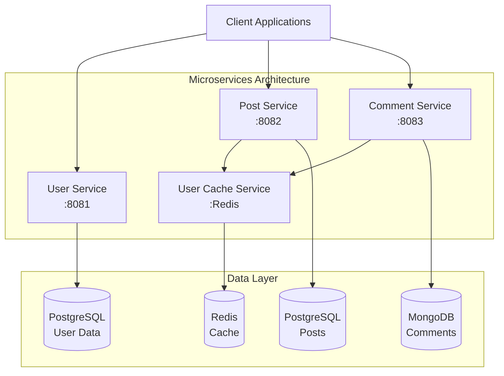
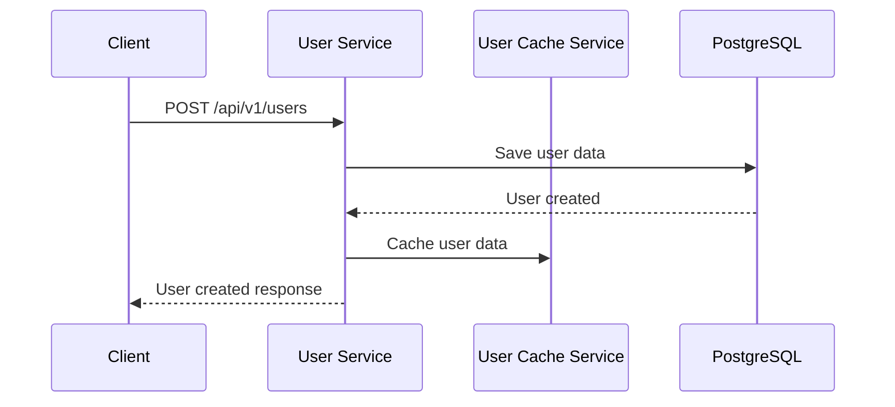
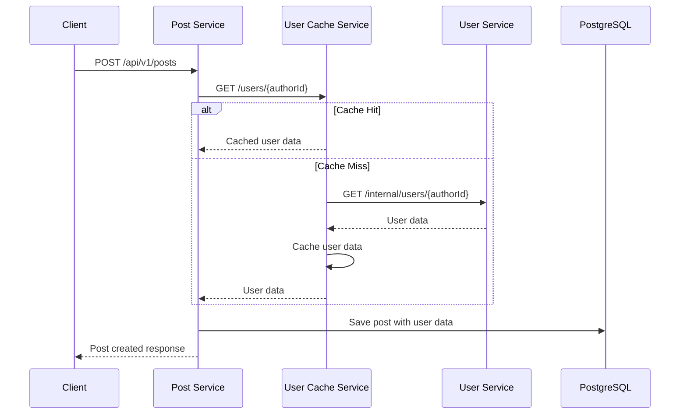
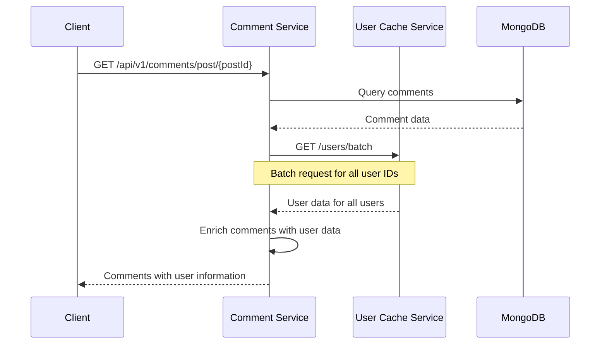

# Service Interactions & Communication Patterns

## 🏗️ Architecture Overview

The microservices architecture consists of four main services that communicate through HTTP REST APIs and shared caching mechanisms.



## 🔄 Service Communication Patterns

### 1. **Synchronous Communication (HTTP REST)**

#### User Service → External Services
- **No outbound dependencies**
- Provides user data to other services
- Acts as the source of truth for user information

#### Post Service → User Cache Service
```http
GET /users/{userId}
Host: user-cache-service
X-Service-Name: post-service
X-Service-Secret: internal-service-secret

Response:
{
  "id": 123,
  "email": "user@example.com",
  "nickname": "john_doe",
  "status": "ACTIVE"
}
```

#### Comment Service → User Cache Service
```http
GET /users/batch
Host: user-cache-service
X-Service-Name: comment-service
X-Service-Secret: internal-service-secret
Content-Type: application/json

{
  "userIds": [123, 456, 789]
}

Response:
{
  "users": [
    {
      "id": 123,
      "email": "user@example.com",
      "nickname": "john_doe"
    }
  ]
}
```

### 2. **Caching Strategy**

#### User Cache Service Pattern
```java
@Service
public class UserCacheService {
    
    @Cacheable(value = "users", key = "#userId")
    public UserDto getUserById(Long userId) {
        // 1. Check Redis cache first
        // 2. If cache miss, call User Service
        // 3. Cache result and return
    }
    
    @CacheEvict(value = "users", key = "#userId")
    public void evictUser(Long userId) {
        // Remove from cache when user updated
    }
}
```

## 📋 API Contracts

### Standard Response Format
All services use the standardized `AppResponse<T>` format:

```json
{
  "success": true,
  "message": "Operation successful",
  "payload": {
    // Service-specific data
  }
}
```

### Error Response Format
```json
{
  "success": false,
  "message": "Error description",
  "payload": null
}
```

## 🔍 Service-Specific APIs

### User Service (Port 8081)
```
Base URL: http://localhost:8081/api/v1

Core Endpoints:
├── GET    /users                    # List users with pagination
├── GET    /users/{id}               # Get user by ID
├── POST   /users                    # Create new user
├── PUT    /users/{id}               # Update user
├── DELETE /users/{id}               # Delete user
├── GET    /users/search?query=...   # RSQL search
└── GET    /users/by-email?email=... # Find by email

Internal Endpoints:
├── POST   /internal/auth/validate-credentials
├── GET    /internal/users/{userId}
├── GET    /internal/users/by-email
└── PUT    /internal/users/{userId}/last-login
```

### Post Service (Port 8082)
```
Base URL: http://localhost:8082/api/v1

Core Endpoints:
├── GET    /posts                    # List posts with pagination
├── GET    /posts/{id}               # Get post by ID
├── POST   /posts                    # Create new post
├── PUT    /posts/{id}               # Update post
├── DELETE /posts/{id}               # Hard delete post
├── DELETE /posts/{id}/soft          # Soft delete post
├── GET    /posts/search?query=...   # RSQL search
├── GET    /posts/author/{authorId}  # Posts by author
└── PUT    /posts/bulk/status        # Bulk status update
```

### Comment Service (Port 8083)
```
Base URL: http://localhost:8083/api/v1

Core Endpoints:
├── GET    /comments                     # List comments with pagination
├── GET    /comments/{id}                # Get comment by ID
├── POST   /comments                     # Create new comment
├── PUT    /comments/{id}                # Update comment
├── DELETE /comments/{id}                # Hard delete comment
├── DELETE /comments/{id}/soft           # Soft delete comment
├── GET    /comments/post/{postId}       # Comments for post
├── GET    /comments/user/{userId}       # Comments by user
├── GET    /comments/post/{postId}/hierarchy  # Hierarchical comments
└── GET    /comments/search?query=...    # RSQL search
```

## 🔐 Internal Service Security

### Authentication Headers
Internal service calls require specific headers:

```http
X-Service-Name: {calling-service-name}
X-Service-Secret: {shared-secret-key}
```

### Configuration
```yaml
app:
  security:
    internal-secret: internal-service-secret-key-2024
```

### Validation Logic
```java
private boolean isValidInternalCall(HttpServletRequest request) {
    String serviceName = request.getHeader("X-Service-Name");
    String serviceSecret = request.getHeader("X-Service-Secret");
    
    return serviceName != null && 
           serviceSecret != null && 
           internalSecret.equals(serviceSecret);
}
```

## 🚀 Data Flow Examples

### 1. **User Registration Flow**


### 2. **Post Creation with User Data**


### 3. **Comment Retrieval with User Enrichment**


## ⚡ Performance Optimizations

### 1. **Batch Operations**
- **User Cache Service** supports batch user retrieval
- Reduces N+1 query problems
- Single request for multiple users

### 2. **Caching Strategy**
- **Redis-based caching** for frequently accessed user data
- **TTL-based expiration** for data consistency
- **Cache warming** strategies for popular data

### 3. **Connection Pooling**
- **HikariCP** for database connections
- **RestTemplate** with connection pooling
- **MongoDB connection pooling**

## 🔧 Configuration Management

### Environment-Specific Configurations
```yaml
spring:
  profiles:
    active: ${SPRING_PROFILES_ACTIVE:dev}

---
# Development Profile
spring:
  config:
    activate:
      on-profile: dev
  datasource:
    url: jdbc:postgresql://localhost:5432/userdb
    username: user_admin
    password: dev_password

---
# Production Profile
spring:
  config:
    activate:
      on-profile: prod
  datasource:
    url: ${DATABASE_URL}
    username: ${DATABASE_USERNAME}
    password: ${DATABASE_PASSWORD}
```

### Service Discovery
Currently using static configuration, but designed for easy migration to:
- **Spring Cloud Netflix Eureka**
- **Consul**
- **Kubernetes Service Discovery**

## 🎯 Best Practices Implemented

### 1. **Resilience Patterns**
- **Timeout configurations** for external calls
- **Retry mechanisms** for transient failures
- **Graceful degradation** when services unavailable

### 2. **Monitoring & Observability**
- **Correlation ID propagation** across services
- **Structured logging** for easy parsing
- **Health check endpoints** for monitoring

### 3. **Security**
- **Internal service authentication**
- **Input validation** on all endpoints
- **Sensitive data masking** in logs

---

This documentation provides a comprehensive overview of how services interact within the microservices architecture, ensuring maintainable and scalable communication patterns.
